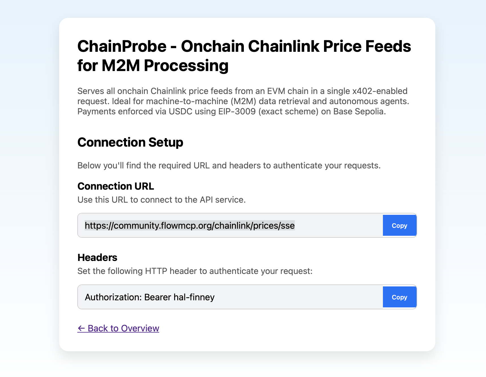

Hier ist deine überarbeitete, ins Englische übersetzte und professionell formatierte `README.md` für dein Hackathon-Projekt **ChainProbe**. Die Blockchain-Auflistung habe ich in eine übersichtliche Tabelle umgewandelt:

---

# ChainProbe – Onchain Chainlink Price Feeds for M2M Processing

**ChainProbe** is an x402-capable MCP server that provides **all** Chainlink price feeds from an EVM blockchain in a single tool call. The data is fetched directly *onchain* and paid for via x402 micropayments using USDC. It's ideal for Machine-to-Machine (M2M) applications, autonomous agents, and AI systems.

---

## 🔗 Live Endpoint

x402 proxy access for compatible clients:



➡️ [https://community.flowmcp.org/chainlink/prices](https://community.flowmcp.org/chainlink/prices)

---

## 📡 What Does ChainProbe Do?

ChainProbe aggregates all Chainlink price feeds of a blockchain into a single endpoint. Access is restricted to valid `X-PAYMENT` headers, using `exact` scheme payments (EIP-3009) via USDC.

### 🌍 Supported Blockchains

| Blockchain        | Number of Feeds |
| ----------------- | --------------- |
| Ethereum Mainnet  | 140             |
| Binance Mainnet   | 125             |
| Polygon Mainnet   | 127             |
| Avalanche Mainnet | 58              |
| Arbitrum Mainnet  | 127             |
| Optimism Mainnet  | 113             |
| Base Mainnet      | 54              |
| Starknet Mainnet  | 9               |
| Linea Mainnet     | 15              |
| Mantle Mainnet    | 6               |
| Scroll Mainnet    | 22              |
| zkSync Mainnet    | 16              |
| Celo Mainnet      | 22              |

---

## ⚙️ Route Details

* **Path:** `/chainlink/prices`
* **Protocol:** Server-Sent Events (`text/event-stream`)
* **Payment:** USDC on Base Sepolia
* **x402 Scheme:** `exact` (EIP-3009)
* **Token:** `hal-finney` (public)
* **Namespaces:** `x402`, `chainlink`

---

## 🧠 Why x402?

x402 replaces traditional API keys and subscriptions with machine-native payments via HTTP 402. It's purpose-built for autonomous systems and agents:

* No API key management
* Pay-per-request
* Fully onchain verifiable
* Ideal for AI and M2M workflows

---

## 🧪 Usage via Proxy (Example)

✅ Connects Claude Mac to
👉 [`https://community.flowmcp.org/chainlink/prices/sse`](https://community.flowmcp.org/chainlink/prices/sse) — a public payment-enforced remote server
✅ Manages payments automatically via proxy using the `X-PAYMENT` header

### Claude Mac Configuration Snippet

```json
{
  "globalShortcut": "",
  "mcpServers": {
    "chainlink-proxy": {
      "command": "node",
      "args": [
        "your/absolute/path/proxyserver.mjs"
      ],
      "env": {
        "SILENT": "true"
      }
    }
  }
}
```

Make sure to create a `.env` file beforehand. See `.example.env` for guidance.

---

## 🛠 Tech Stack

* Express.js with x402 middleware
* Server-Sent Events output
* Onchain Chainlink Aggregators
* Payments using `exact` scheme (EIP-3009)
* Running on Base Sepolia Testnet

---

## 🧩 Modules Built for the Hackathon

Several modules were created from scratch or extended to support full x402 integration:

| Module                                                                  | Description                                                                 |
| ----------------------------------------------------------------------- | --------------------------------------------------------------------------- |
| [`x402-core`](https://github.com/FlowMCP/x402-core)                     | 🔧 Built from scratch: full client/server logic for EIP-3009 token payments |
| [`x402-mcp-middleware`](https://github.com/FlowMCP/x402-mcp-middleware) | 🔧 Built from scratch: enforces x402 payments in Express-based AI tools     |
| [`FlowMCP`](https://github.com/FlowMCP)                                 | ♻️ Extended: tool orchestration & schema-based agent framework              |
| [`community-server`](https://github.com/FlowMCP/community-server)       | ♻️ Extended: live integration server hosting all modules                    |

🔗 All modules are live at: [https://community.flowmcp.org/chainlink/prices/sse](https://community.flowmcp.org/chainlink/prices/sse)

---

## 🔮 Next Steps

* Pricing via EIP-2612
* Multi-chain support
* Symbol-based feed filtering
* Statistical aggregation (24h, 7d, etc.)

---

## 📚 Resources

* [x402 Whitepaper](https://x402.org)
* [Chainlink Documentation](https://docs.chain.link)
* [x402 Experiments GitHub](https://github.com/FlowMCP/x402-experiments)

